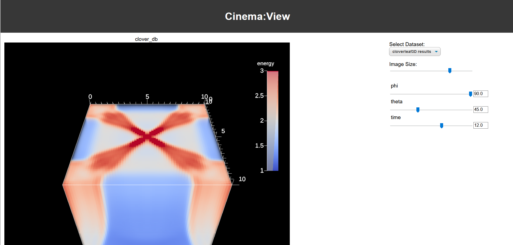

# CloverLeaf3D with Ascent in Container
This project contains a Dockerfile and all necessary components to create a Docker container for CloverLeaf3D. 
The container is available on [Dockerhub](https://hub.docker.com/repository/docker/mswill/elwe_clover), however these versions may not always be up to date.

## Building the container
The Ascent actions can be changed by editing [ascent_actions.yaml](https://github.com/m-s-will/clover/blob/main/clover/inputs/ascent/ascent_actions.yaml).
When finished with the customization, the container can be rebuilt by navigating into the source directory and executing:
	
	$ docker build -t <mytag> .

The CloverLeaf3D simulation is being run during container creation and provides a Cinema database.

## Running the container
After either pulling or building the container, it can be run by calling:

    $ docker run -p 80:80 <mytag>.
    
`-p 80:80` makes port 80 available on the outside which is needed for the Cinema viewer. We can then connect to it by visiting `localhost:80` in our browser.

Overview over the Cinema viewer running via nginx in the container.

